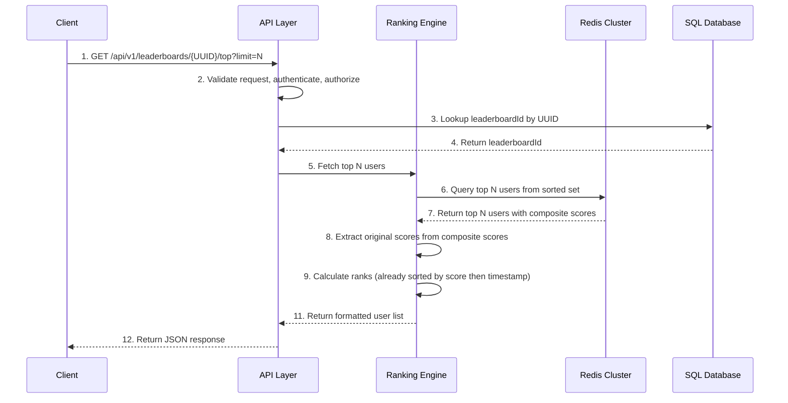
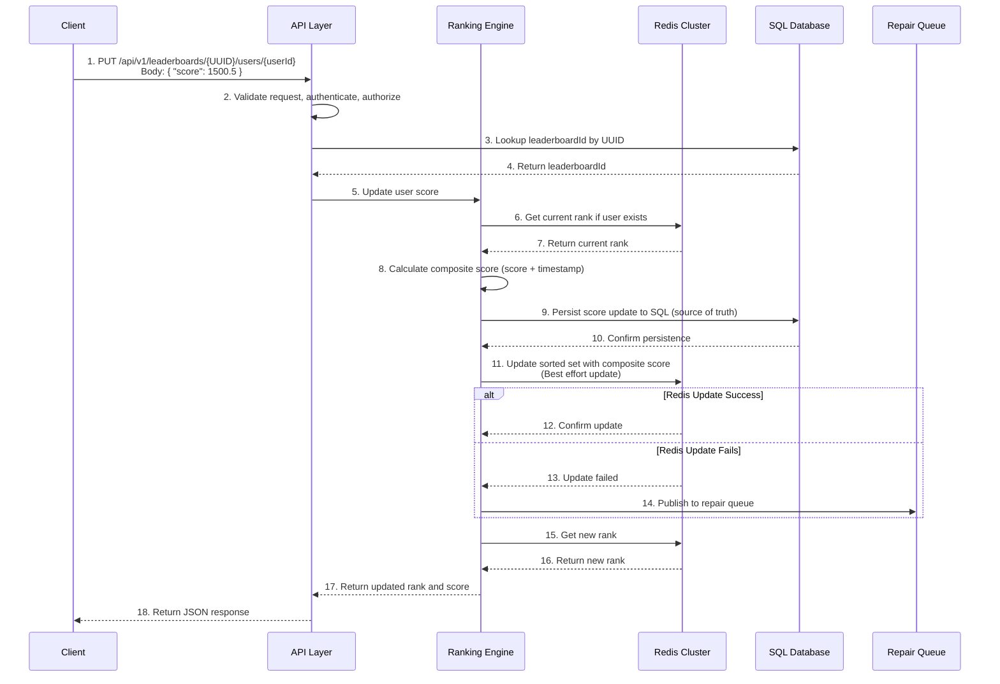
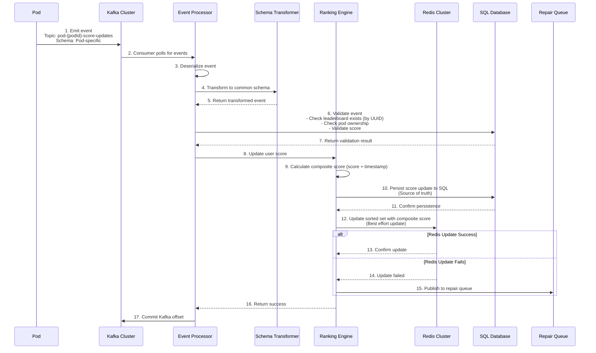
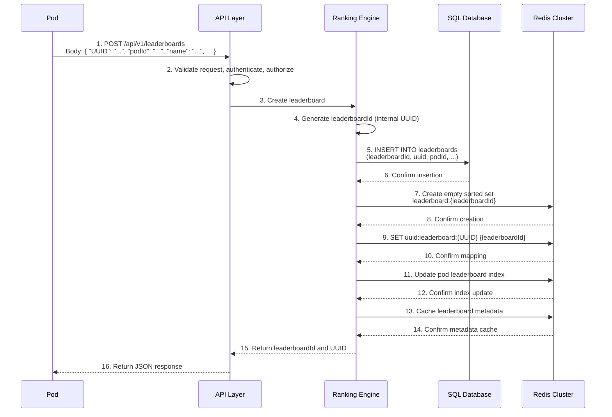
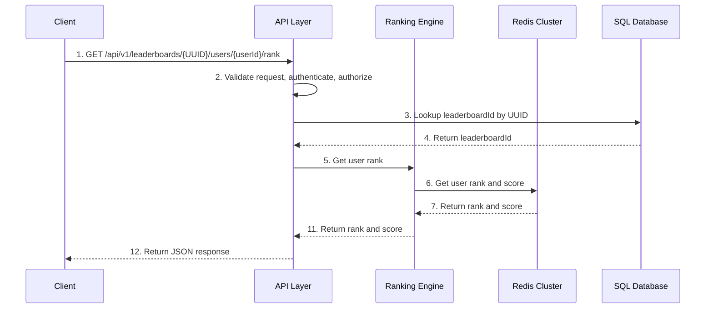

# Leaderboard Service - Technical Documentation

## Table of Contents
1. [Overview](#overview)
2. [Functional Requirements](#functional-requirements)
3. [Solution Overview](#solution-overview)
4. [High-Level Design (HLD)](#high-level-design-hld)
5. [Low-Level Design (LLD)](#low-level-design-lld)
   - [Data Models](#data-models)
   - [Schema Transformation](#schema-transformation)
   - [Datastore Design](#datastore-design)
   - [Data Flows](#data-flows)
6. [API Specifications](#api-specifications)
7. [Failure Scenarios & Mitigation](#failure-scenarios--mitigation)
8. [Non-Functional Requirements](#non-functional-requirements)

---

## Overview

Platform service providing leaderboard functionality across multiple pods. Supports efficient score updates and ranking retrieval.

**Core Capabilities**:
- Fetch top N users from a leaderboard
- Update user scores and ranks
- Process score updates via Kafka events

---

## Functional Requirements

### FR1: Fetch Top N Users
- Retrieve top N users from a leaderboard by UUID
- Returns users with ranks, scores, and timestamps
- Tie-breaking: Users with same score ranked by timestamp (earliest gets higher rank)

### FR2: Update User Rank
- Update user score in a leaderboard
- Returns updated rank
- Creates new entry if user doesn't exist

### FR3: Leaderboard Management
- Create leaderboards with metadata (UUID, podId, time windows, status)
- Update leaderboard status and metadata

### FR4: Event Processing
- Consume score update events from Kafka
- Transform pod-specific schemas to common schema
- Process updates asynchronously

---

## Solution Overview

**Architecture**: Event-driven with CQRS pattern (separate read/write paths)

**Technology Stack**:
- REST API for leaderboard operations
- Kafka for asynchronous event processing
- Redis sorted sets for fast reads and ranking
- SQL database for persistent storage

**Key Design**:
- Redis for fast read operations (O(log N) complexity)
- SQL as source of truth for all data
- Kafka for decoupled, asynchronous score updates

---

## High-Level Design (HLD)

**Architecture**: Pods emit events to Kafka → Leaderboard Service processes events → Updates stored in SQL (source of truth) and Redis (cache)

**Components**:
- **API Layer**: REST endpoints, authentication, validation
- **Event Processor**: Consumes Kafka events, transforms schemas, processes updates
- **Ranking Engine**: Calculates ranks, handles tie-breaking, manages leaderboard state
- **Data Stores**: SQL (persistent), Redis (cache for fast reads)

---

## Low-Level Design (LLD)

### Data Models

#### Leaderboard Model
```json
{
  "leaderboardId": "abc-123-def-456",
  "UUID": "client-provided-uuid-123",
  "podId": "pod-1",
  "name": "Monthly Challenge",
  "createdAt": "2024-01-15T10:00:00Z",
  "createdBy": "user123",
  "startTime": "2024-01-01T00:00:00Z",
  "endTime": "2024-01-31T23:59:59Z",
  "status": "ACTIVE",
  "metadata": {
    "category": "gaming",
    "prize": "Gold Medal"
  }
}
```

#### User Score Model
```json
{
  "userId": "user123",
  "leaderboardId": "abc-123-def-456",
  "score": 1500.5,
  "timestamp": "2024-01-15T10:30:00Z",
  "rank": 42
}
```

#### Event Schema (Common)
```json
{
  "eventId": "event-uuid-456",
  "eventType": "SCORE_UPDATE",
  "podId": "pod-1",
  "UUID": "client-provided-uuid-123",
  "userId": "user123",
  "score": 1500.5,
  "timestamp": "2024-01-15T10:30:00Z",
  "metadata": {
    "source": "game-match-789"
  }
}
```

### Schema Transformation

The Leaderboard Service consumes events from multiple pods, each potentially using different event schemas. A **Schema Transformer** component normalizes all incoming events into a unified common schema using a **Schema Registry** approach.

#### Transformation Architecture

**Kafka Topic Pattern**: Each pod publishes to its own topic: `pod-{podId}-score-updates`

**Transformation Flow**:
1. Event Processor consumes events from pod-specific Kafka topics
2. Schema Transformer looks up pod schema configuration from Schema Registry
3. Applies field mappings and transformations based on registry configuration
4. Transformed event is validated against the common schema
5. Validated event is processed by the Ranking Engine

#### Schema Registry Approach

The Schema Registry maintains a centralized mapping of pod IDs to their schema transformation configurations. Each pod's configuration defines:

- **Field Mappings**: Maps pod-specific field names to common schema fields
- **Timestamp Format**: Specifies how to parse timestamps (ISO_8601, EPOCH_MILLIS, EPOCH_SECONDS)
- **Score Type**: Defines score data type (integer, double)
- **Schema Version**: Tracks schema version for evolution support

**Schema Registry Structure**:
```json
{
  "pod-1": {
    "schemaVersion": "1.0",
    "fieldMappings": {
      "userId": "playerId",
      "score": "points",
      "timestamp": "gameTime",
      "UUID": "leaderboardUuid"
    },
    "timestampFormat": "ISO_8601",
    "scoreType": "integer"
  },
  "pod-2": {
    "schemaVersion": "1.0",
    "fieldMappings": {
      "userId": "customerId",
      "score": "rewardPoints",
      "timestamp": "transactionTimestamp",
      "UUID": "leaderboardId"
    },
    "timestampFormat": "EPOCH_MILLIS",
    "scoreType": "double"
  },
  "pod-3": {
    "schemaVersion": "1.0",
    "fieldMappings": {
      "userId": "user.id",
      "score": "score.value",
      "timestamp": "eventTime",
      "UUID": "context.leaderboardUuid"
    },
    "timestampFormat": "ISO_8601",
    "scoreType": "double"
  }
}
```

#### Transformation Logic

The transformer uses the schema registry configuration to:

1. **Extract Fields**: Uses path-based field extraction (supports nested fields via dot notation like `user.id` or `context.leaderboardUuid`)
2. **Convert Timestamps**: Transforms timestamps to ISO 8601 format based on the configured format
3. **Normalize Scores**: Converts scores to double type, validates they are numeric and non-negative
4. **Generate Common Fields**: Sets `podId` (from Kafka topic), `eventId` (generated or extracted), `eventType` ("SCORE_UPDATE")
5. **Extract Metadata**: Captures all non-mapped fields into the metadata object

**Transformation Pseudocode**:
```java
CommonEvent transform(PodEvent podEvent, String podId) {
    SchemaConfig config = schemaRegistry.get(podId);
    CommonEvent commonEvent = new CommonEvent();
    
    // Extract and map fields using registry configuration
    commonEvent.setUserId(extractField(podEvent, config.fieldMappings.userId));
    commonEvent.setScore(extractField(podEvent, config.fieldMappings.score));
    commonEvent.setUUID(extractField(podEvent, config.fieldMappings.UUID));
    commonEvent.setTimestamp(convertTimestamp(
        extractField(podEvent, config.fieldMappings.timestamp), 
        config.timestampFormat
    ));
    
    // Set common fields
    commonEvent.setPodId(podId);
    commonEvent.setEventId(generateEventId(podEvent));
    commonEvent.setEventType("SCORE_UPDATE");
    commonEvent.setMetadata(extractMetadata(podEvent, config.fieldMappings));
    
    return commonEvent;
}
```

#### Transformation Example

**Input (Pod 1 Schema)**:
```json
{
  "matchId": "match-abc-123",
  "playerId": "player-789",
  "points": 2500,
  "gameTime": "2024-01-15T10:30:00.000Z",
  "leaderboardUuid": "lb-uuid-123",
  "gameMode": "ranked"
}
```

**Output (Common Schema)**:
```json
{
  "eventId": "evt-generated-uuid-001",
  "eventType": "SCORE_UPDATE",
  "podId": "pod-1",
  "UUID": "lb-uuid-123",
  "userId": "player-789",
  "score": 2500.0,
  "timestamp": "2024-01-15T10:30:00.000Z",
  "metadata": {
    "matchId": "match-abc-123",
    "gameMode": "ranked"
  }
}
```

#### Error Handling

- **Schema Mismatch**: Missing required fields → log error, send to DLQ, don't commit Kafka offset
- **Conversion Errors**: Invalid score/timestamp → validate and reject, send to DLQ, emit alerts if error rate high
- **Unknown Pod**: Pod ID not in registry → reject immediately, send to DLQ, alert operations team
- **Validation**: After transformation, validate all required fields present, score is positive, timestamp is valid ISO 8601

#### Schema Evolution

- **Versioning**: Each pod schema has a version; registry supports multiple versions per pod for backward compatibility
- **Adding Pods**: Pod provides schema → add to registry → configure mappings → test in staging → activate in production
- **Updating Schemas**: Add new version to registry → support both versions during transition → deprecate old version after migration → remove after deprecation period

### Datastore Design

#### 1. SQL Database Schema

**SQL Tables**:
- `leaderboards`: leaderboard_id (PK), uuid (unique), pod_id, name, start_time, end_time, status, metadata
- `user_scores`: id (PK), user_id, leaderboard_id, score, timestamp (indexed for ranking queries)
- `user_score_history`: Audit trail for score changes (optional)

#### 2. Redis Data Structure

##### Sorted Set per Leaderboard

**Key Pattern**: `leaderboard:{leaderboardId}` (using internal leaderboardId)

**Structure**: Redis Sorted Set (ZSET)
- **Score**: Composite score combining user score and timestamp
- **Member**: User ID (as string)

**Composite Score Calculation**:
- Formula: `composite_score = (score * multiplier) + (max_timestamp - timestamp)`
- Multiplier: Large number (e.g., 10,000,000,000,000) to ensure score takes precedence
- max_timestamp: Maximum timestamp value (e.g., 9999999999999 for year 2286)
- This ensures: Higher scores rank higher, and for equal scores, earlier timestamps rank higher

**Example**:
- User A: score=1000, timestamp=1000 → composite = (1000 * 10^13) + (9999999999999 - 1000) = 10009999999998999
- User B: score=1000, timestamp=2000 → composite = (1000 * 10^13) + (9999999999999 - 2000) = 10009999999997999
- User A ranks higher (larger composite score) due to earlier tmestamp

**Retrieval**:
- Original score = `floor(composite_score / multiplier)`
- Timestamp can be extracted if needed: `timestamp = max_timestamp - (composite_score % multiplier)`

##### Additional Redis Structures

- **Metadata Cache**: `leaderboard:meta:{leaderboardId}` - Cached leaderboard metadata
- **UUID Mapping**: `uuid:leaderboard:{UUID}` - Maps client UUID to internal leaderboardId
- **Pod Index**: `pod:leaderboards:{podId}` - List of leaderboards per pod

### Data Flows

#### Flow 1: Fetch Top N Users (Read Path)



#### Flow 2: Update User Rank via API (Write Path)



#### Flow 3: Update User Rank via Kafka Event (Event-Driven Path)



#### Flow 4: Leaderboard Creation



#### Flow 5: Get User Rank



### Data Consistency

- SQL is source of truth (all writes persisted first)
- Redis is cache (updated after SQL, best effort)
- Repair flows ensure eventual consistency if Redis updates fail

### Data Synchronization

The service maintains consistency between Redis (cache) and SQL (source of truth). Two approaches are discussed below.

#### Approach 1: SQL-First Write with Repair Flows (Current Implementation)

**Summary**: Write to SQL first (source of truth), then update Redis asynchronously. Use periodic repair flows to reconcile inconsistencies.

**Write Path**: Write to SQL → Update Redis (best effort) → Queue for repair if Redis fails

**Repair Flows**:
- Time-based: Every 10 minutes, reconcile last 15 minutes of updates
- Event-driven: Process repair queue continuously
- Full reconciliation: Nightly rebuild from SQL

**Advantages**:
- ✅ High performance (async Redis updates)
- ✅ High availability (Redis failures don't block SQL writes)
- ✅ High throughput (can handle 10K+ writes/s)

**Disadvantages**:
- ❌ Eventual consistency (temporary inconsistency between Redis and SQL)
- ❌ Complexity (requires repair flow infrastructure)
- ❌ Detection delay (inconsistencies may exist until repair runs)

#### Approach 2: Two-Phase Commit (2PC)

**Summary**: Ensure both Redis and SQL are updated atomically using a two-phase commit protocol.

**Implementation**:
- **Phase 1 (Prepare)**: 
  - Prepare SQL transaction
  - Prepare Redis transaction
- **Phase 2 (Commit/Rollback)**:
  - If both prepare successfully: Commit both
  - If either fails: Rollback both

**Advantages**:
- ✅ Strong consistency (both stores updated atomically or not at all)
- ✅ No data loss (either both succeed or both fail)
- ✅ Immediate consistency (Redis and SQL always in sync)
- ✅ Simplified recovery (no need for complex repair flows)

**Disadvantages**:
- ❌ Performance impact (synchronous writes to both stores increase latency)
- ❌ Complexity (two-phase commit adds operational complexity)
- ❌ Availability (if Redis is down, SQL writes may be blocked)
- ❌ Scalability (synchronous operations limit throughput)
- ❌ Distributed transaction overhead (network latency and coordination overhead)

#### Approach 3: CDC with Debezium

**Advantages**:
- ✅ Guaranteed durability: SQL commits are durable before CDC captures them
- ✅ Decoupled: Redis failures don't block SQL writes (like Approach 1)
- ✅ Ordered delivery: Debezium preserves transaction order
- ✅ At-least-once semantics: No data loss from SQL to Redis
- ✅ Lower latency than 2PC: ~20-50ms vs 50-100ms
- ✅ Better throughput: 5K-10K ops/s (between Approach 1 & 2PC)
- ✅ Automatic retry: Built-in retry mechanisms for failed Redis updates

---

## API Specifications

**Base URL**: `/api/v1`

**Authentication**: API Key or OAuth 2.0 Bearer token

### 1. Fetch Top N Users

**Endpoint**: `GET /leaderboards/{UUID}/top?limit=N`

**Query Parameters**:
- `limit` (required, integer, 1-1000): Number of top users to retrieve
- `offset` (optional, integer, default: 0): Pagination offset

**Response**:
```json
{
  "UUID": "client-provided-uuid-123",
  "users": [
    {
      "userId": "user123",
      "rank": 1,
      "score": 2500.5,
      "timestamp": "2024-01-15T10:30:00Z"
    },
    {
      "userId": "user456",
      "rank": 2,
      "score": 2300.0,
      "timestamp": "2024-01-15T10:25:00Z"
    }
  ],
  "totalUsers": 1500,
  "retrievedAt": "2024-01-15T10:35:00Z"
}
```

### 2. Update User Rank

**Endpoint**: `PUT /leaderboards/{UUID}/users/{userId}`

**Request Body**:
```json
{
  "score": 1500.5
}
```

**Response**:
```json
{
  "UUID": "client-provided-uuid-123",
  "userId": "user123",
  "score": 1500.5,
  "rank": 42,
  "updatedAt": "2024-01-15T10:35:00Z"
}
```

### 3. Get User Rank

**Endpoint**: `GET /leaderboards/{UUID}/users/{userId}/rank`

**Response**:
```json
{
  "UUID": "client-provided-uuid-123",
  "userId": "user123",
  "rank": 42,
  "score": 1500.5,
  "timestamp": "2024-01-15T10:35:00Z"
}
```

### 4. Create Leaderboard

**Endpoint**: `POST /leaderboards`

**Request Body**:
```json
{
  "UUID": "client-provided-uuid-123",
  "podId": "pod-1",
  "name": "Monthly Challenge",
  "startTime": "2024-01-01T00:00:00Z",
  "endTime": "2024-01-31T23:59:59Z",
  "metadata": {
    "category": "gaming",
    "prize": "Gold Medal"
  }
}
```

**Response**:
```json
{
  "UUID": "client-provided-uuid-123",
  "podId": "pod-1",
  "name": "Monthly Challenge",
  "status": "ACTIVE",
  "createdAt": "2024-01-15T10:00:00Z",
  "startTime": "2024-01-01T00:00:00Z",
  "endTime": "2024-01-31T23:59:59Z"
}
```

### 5. Get Leaderboard Metadata

**Endpoint**: `GET /leaderboards/{UUID}`

**Response**:
```json
{
  "UUID": "client-provided-uuid-123",
  "podId": "pod-1",
  "name": "Monthly Challenge",
  "status": "ACTIVE",
  "createdAt": "2024-01-15T10:00:00Z",
  "startTime": "2024-01-01T00:00:00Z",
  "endTime": "2024-01-31T23:59:59Z",
  "totalUsers": 1500
}
```

---

## Failure Scenarios & Mitigation

1. **Redis Failure**:
   - **Impact**: Read operations fail
   - **Mitigation**: Failover to replica, rebuild from SQL if needed

2. **SQL Failure**:
   - **Impact**: Writes fail, no persistence
   - **Mitigation**: Failover to replica, queue writes if both fail

3. **Kafka Failure**:
   - **Impact**: Event processing stops
   - **Mitigation**: Kafka cluster with replication, retry mechanism

4. **Service Failure**:
   - **Impact**: API unavailable
   - **Mitigation**: Multiple instances, health checks, auto-restart

---

## Non-Functional Requirements

### NFR1: Performance
- **Latency**: Fetch Top N < 50ms (p95), Update Rank < 100ms (p95)
- **Throughput**: 10,000 reads/s, 5,000 writes/s per leaderboard
- **Response Time**: 99% of requests < 100ms

### NFR2: Scalability
- Support 1,000 concurrent leaderboards
- Support 1 million users per leaderboard
- Support 100 pods
- Horizontal scaling via load balancers and Redis clusters

### NFR3: Availability
- 99.9% uptime (8.76 hours downtime/year)
- Fault tolerance: Continue operating during single component failures
- Graceful degradation: Reads work even if writes are temporarily unavailable

### NFR4: Consistency
- Eventual consistency for score updates (within 1 second)
- Strong consistency for reads from Redis
- All updates persisted to SQL

### NFR5-NFR8: Reliability, Security, Observability, Maintainability
- Data persistence, authentication, authorization, logging, metrics, monitoring
